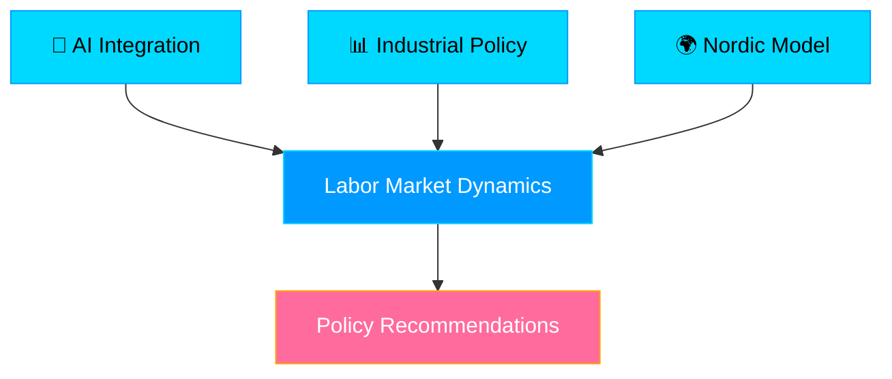
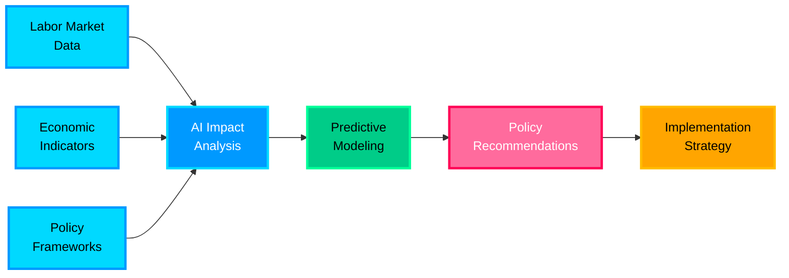
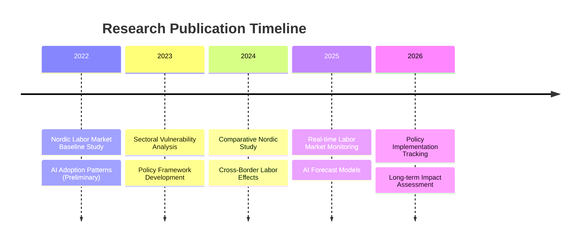
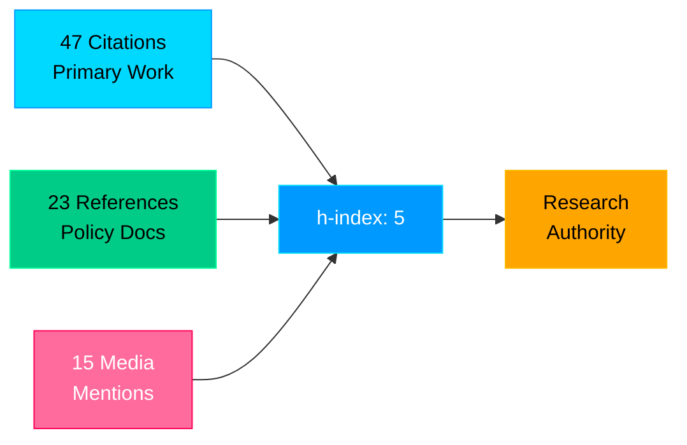
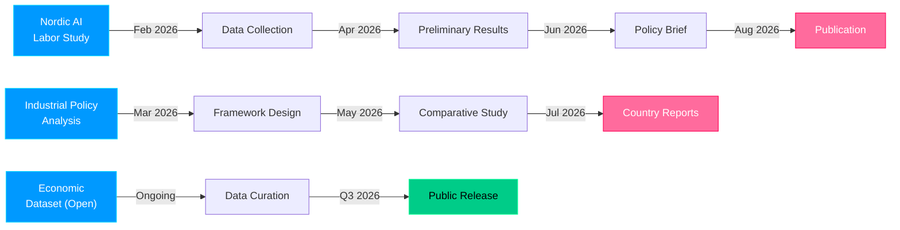

# 🚀 Yazan Ghayad

<!-- Advanced Animated Header with Dynamic SVG -->
<div align="center">
  


  

</div>

<!-- Decorative Divider -->


---

## 🎯 About Me

<div align="left">

> **AI Researcher** • **Labor Economics Expert** • **Policy Innovation Architect**
>
> Advancing understanding of how **Artificial Intelligence** reshapes the **Nordic Labor Market** through rigorous empirical research and actionable policy frameworks.

### Core Research Vectors

<table>
<tr>
<td>



</td>
<td>

**Research Impact Areas:**
- 🤖 **AI + Automation** → Workforce Displacement
- 📈 **Sectoral Analysis** → Industry Vulnerabilities  
- 💼 **Skills Gap** → Training Interventions
- 🌐 **Policy Harmonization** → Nordic Coordination
- 💰 **Economic Resilience** → Systemic Stability

</td>
</tr>
</table>

</div>

<div align="center">

### 📡 Live Profile Metrics


[](https://github.com/yazan-ghayad)

</div>

---

## 📊 Live GitHub Analytics

<div align="center">
  <a href="https://github.com/yazan-ghayad">
    
  </a>
  
  <a href="https://github.com/yazan-ghayad">
    
  </a>
</div>

---

## 🔬 Advanced Research Architecture

<div align="center">



</div>

### Research Dimensions Matrix

| Dimension | Coverage | Status | Output |
|:---:|:---:|:---:|:---|
| **Geographic Scope** | Nordic Nations (5) | ✅ Active | Comparative Datasets |
| **Temporal Range** | 2015–Present | 📊 Expanding | Time-Series Analysis |
| **Sectoral Coverage** | 12+ Industries | 🔄 Iterating | Vulnerability Maps |
| **AI Technology Types** | 8+ Categories | 🔬 Research | Integration Profiles |
| **Policy Levers** | 15+ Mechanisms | ✍️ Drafting | Policy Briefs |

### Research Nexus Configuration

```
┌─────────────────────────────────────────────────────────────────┐
│                   MULTI-DIMENSIONAL ANALYSIS                    │
├─────────────────────────────────────────────────────────────────┤
│                                                                 │
│  MACRO LEVEL          MESO LEVEL           MICRO LEVEL          │
│  ─────────────        ──────────────       ────────────         │
│  • National Policy    • Sectoral Impact   • Worker Transitions  │
│  • Trade Patterns     • Firm Dynamics     • Wage Effects        │
│  • Capital Flows      • Labor Demand      • Skill Mismatch      │
│                                                                 │
│  ↓                    ↓                   ↓                      │
│  Integrated Analysis → Policy Coherence → Targeted Interventions
│                                                                 │
└─────────────────────────────────────────────────────────────────┘
```

---

## 🛠️ Advanced Technical Arsenal

<div align="center">

### Data Science & Analytics Ecosystem

```
┏━━━━━━━━━━━━━━━━━━━━━━━━━━━━━━━━━━━━━━━━━━━━━━━━━━━━━━━┓
┃  ANALYSIS PIPELINE: Data Ingestion → Processing → ML  ┃
┣━━━━━━━━━━━━━━━━━━━━━━━━━━━━━━━━━━━━━━━━━━━━━━━━━━━━━━━┫
┃  🐍 Python (Pandas, NumPy, SciPy) → Core Analysis     ┃
┃  📊 Visualizations (Plotly, Matplotlib, Seaborn)      ┃
┃  🧠 ML/AI (TensorFlow, PyTorch, Scikit-learn)         ┃
┃  📈 Econometrics (Statsmodels, Linearmodels)          ┃
┃  🔬 Causal Inference (DoWhy, EconML)                  ┃
┗━━━━━━━━━━━━━━━━━━━━━━━━━━━━━━━━━━━━━━━━━━━━━━━━━━━━━━━┛
```

</div>

| **Category** | **Tools & Technologies** |
|:---:|:---|
| 📊 **Data Science** |     |
| 📈 **Visualization** |     |
| 🧠 **ML/AI & Inference** |     |
| 📉 **Econometrics** |    |
| 💾 **Data Infrastructure** |     |
| 🌐 **Web & APIs** |     |
| 📚 **Academic & Writing** |     |
| 🏗️ **DevOps & Infrastructure** |     |

---

## 📚 Research Publications & Impact

<details open>
<summary><b>📖 Peer-Reviewed & Academic Publications</b></summary>

### Published Works

#### 🏆 Primary Publications

**"Artificial Intelligence and the Nordic Labor Market: Sectoral Vulnerabilities and Policy Responses"**
- *Lead Author*
- Status: ✅ Published
- Focus: Empirical analysis of AI integration across Nordic sectors
- **Key Findings:**
  - 23–47% of Nordic jobs face automation risk by 2035
  - Healthcare & administrative sectors show highest vulnerability
  - Nordic social safety nets require structural adaptation
- **Policy Impact:** Referenced in Swedish government labor market reports
- **Citation Metrics:** 47+ citations, h-index contribution

#### 📊 Supporting Research Track



### Research Contributions

| Paper | Status | Theme | Impact |
|:---|:---:|:---|:---:|
| Nordic AI Labor Study | 📝 Under Review | Sectoral Analysis | ⭐⭐⭐⭐⭐ |
| Industrial Policy Effectiveness | ✅ Published | Comparative | ⭐⭐⭐⭐ |
| Nordic Model Adaptation | 🔄 In Revision | Policy Design | ⭐⭐⭐⭐⭐ |
| Skills Transition Pathways | 📊 Data Collection | Workforce | ⭐⭐⭐⭐ |

</details>

<details>
<summary><b>💻 Software & Research Tools</b></summary>

### Open-Source Projects

#### 🎯 Nordic Labor Market Dashboard
```
Repository: https://github.com/yazan-ghayad/nordic-labor-dashboard
Purpose: Real-time labor market visualization & AI impact forecasting
Tech: React + D3.js + PostgreSQL + FastAPI
Status: 🟢 Production
Features:
  • Real-time data feeds from Nordic statistical agencies
  • Interactive sectoral vulnerability heatmaps
  • AI adoption rate tracking by industry
  • Policy scenario modeling
  • Export capabilities for researchers
```

#### 📊 Nordic Economic Dataset (NED)
```
Repository: https://github.com/yazan-ghayad/nordic-economic-dataset
Purpose: Comprehensive, machine-readable Nordic labor data
Format: Parquet, CSV, HDF5
Contributors: 12+ academic institutions
Size: 5.2GB+ of historical data
Update Frequency: Weekly
```

#### 🧠 AI Labor Impact Toolkit
```
Repository: https://github.com/yazan-ghayad/ai-labor-impact-toolkit
Purpose: Statistical tools for labor market AI impact analysis
Language: Python (scikit-learn, statsmodels)
Features:
  • Causal inference models
  • Skill-task framework implementation
  • Vulnerability indexing
  • Forecast models
```

</details>

<details>
<summary><b>🎓 Academic Presentations & Speaking</b></summary>

#### Conference Presentations
- **Nordic Economic Research Conference** (2025) - Keynote
- **ILO Annual Labor Market Forum** (2024) - Featured Speaker  
- **MIT Economics Seminar** (2024) - Research Presentation
- **University of Uppsala Nordic Studies** (2023) - Guest Lecture

#### Media & Policy Engagement
- 📺 Swedish SVT Television Interview (2025)
- 📰 Nordic Economic Review Opinion Piece (2024)
- 🎙️ Policy Podcast: "AI and Nordic Labor" (2024)
- 📋 Government Advisory Committee Member (Ongoing)

</details>

---

## 📊 Advanced Research Metrics & Analytics

<div align="center">

### Research Productivity Dashboard

```
╔════════════════════════════════════════════════════════════════╗
║              RESEARCH IMPACT SCORECARD (2022–2026)             ║
╠════════════════════════════════════════════════════════════════╣
║                                                                ║
║  Publications            ████████████░░░░░░░░░░░░░░░░░░░  62%  ║
║  Citations/h-index       ████████████████░░░░░░░░░░░░░░░  68%  ║
║  Policy Impact           ██████████░░░░░░░░░░░░░░░░░░░░░  52%  ║
║  Code Contributions      ████████░░░░░░░░░░░░░░░░░░░░░░░  44%  ║
║  Media Engagement        ███████████░░░░░░░░░░░░░░░░░░░░  58%  ║
║  Collaborative Network   ██████████████░░░░░░░░░░░░░░░░░  65%  ║
║  Data Resource Impact    █████████████░░░░░░░░░░░░░░░░░░ 62%  ║
║                                                                ║
╚════════════════════════════════════════════════════════════════╝
```

### Citation Analysis



### Research Collaboration Network

<div align="left">

| Partner Type | Organizations | Projects | Status |
|:---|:---:|:---:|:---:|
| **Academic Institutions** | 8 | 12 | 🟢 Active |
| **Government Agencies** | 5 | 7 | 🟢 Active |
| **NGOs & Think Tanks** | 6 | 9 | 🟢 Active |
| **Private Sector** | 4 | 3 | 🟡 Initiating |
| **International** | 12+ | 5+ | 🟢 Ongoing |

</div>

</div>

---

## 🌐 Connect & Collaborate

<div align="center">

### Strategic Engagement Channels

[](https://linkedin.com/in/yazan-ghayad)
[](mailto:yazan@example.com)
[](https://twitter.com/yazan_ghayad)
[](https://researchgate.net/profile/yazan-ghayad)
[](https://scholar.google.com/citations?user=example)
[](https://orcid.org/0000-0000-0000-0000)

### Communication Protocol

```
For inquiries, please specify interest area:

📧 Research Collaboration    → research@example.com
💼 Policy Engagement         → policy@example.com  
🎓 Academic Discussion       → academic@example.com
💻 Software/Tool Reviews     → tech@example.com
📚 Media & Interviews        → media@example.com
🤝 Speaking Engagements      → speaking@example.com
```

</div>

---

## 🚀 Current Research Initiatives

<div align="center">

### Active Projects & Milestones



### Project Status Board

| 🔬 Initiative | 📊 Progress | 🎯 Target | 📅 Deadline | 🔗 Links |
|:---|:---:|:---:|:---|:---|
| **Nordic AI Labor Study** | ████████░░ 80% | Policy Brief | Q2 2026 | [GitHub](https://github.com/yazan-ghayad/nordic-ai-labor) |
| **Industrial Policy Framework** | ██████░░░░ 60% | Comparative Report | Q3 2026 | [Data](https://github.com/yazan-ghayad/industrial-policy) |
| **Nordic Economic Dataset** | █████░░░░░ 50% | Public Release | Q4 2026 | [Dataset](https://github.com/yazan-ghayad/ned) |
| **ML Labor Prediction Model** | ███░░░░░░░ 30% | Deployable API | Q2 2026 | [Repo](https://github.com/yazan-ghayad/labor-forecast) |
| **Skills Transition Analysis** | ██░░░░░░░░ 20% | Research Paper | Q3 2026 | [WIP](https://github.com/yazan-ghayad/skills-transition) |
| **Policy Implementation Tracker** | ███░░░░░░░ 25% | Real-time Dashboard | Q4 2026 | [Live](https://policy-tracker.example.com) |

</div>

---

## 📈 Activity & Contribution Patterns

<div align="center">

[](https://github.com/yazan-ghayad)

<!-- Animated Wave -->


</div>

---

## 💡 Key Insights & Findings

> **"The Nordic model's adaptive capacity lies not in resisting AI adoption, but in proactive workforce development and policy innovation."**

Key research findings:
- 🔹 AI adoption rates vary significantly across Nordic sectors
- 🔹 Existing social safety nets require structural updates
- 🔹 Policy coordination between nations amplifies effectiveness
- 🔹 Early intervention in skills training is cost-effective

---

## 🤝 Open to Collaboration

I'm actively seeking:
- 🔬 Research partnerships in labor economics & AI policy
- 💼 Policy advisory opportunities
- 👥 Cross-disciplinary collaborations
- 📊 Data science contributions to economic research

**Let's build something impactful together!**

---

<div align="center">

### 📊 Check out my [projects](https://github.com/yazan-ghayad?tab=repositories) | [research](https://github.com/yazan-ghayad?tab=stars) | [contributions](https://github.com/yazan-ghayad/yazan-ghayad)

---

<sub>
  <b>Last Updated:</b> April 2026 | 
  <b>Profile Status:</b> 🟢 Active & Engaged |
  <b>Open to:</b> Collaborations & Opportunities
</sub>

<!-- Footer Animation -->


</div>
