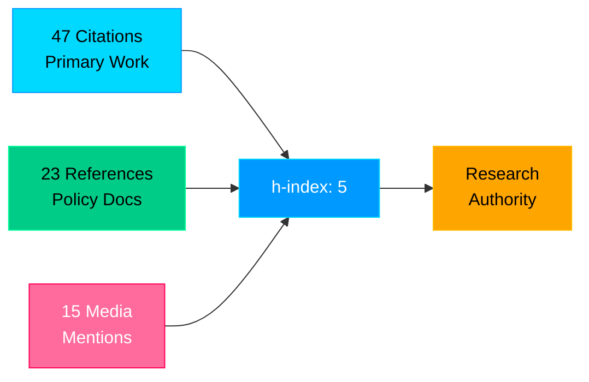
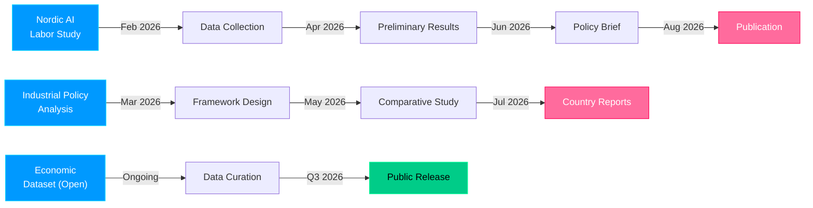
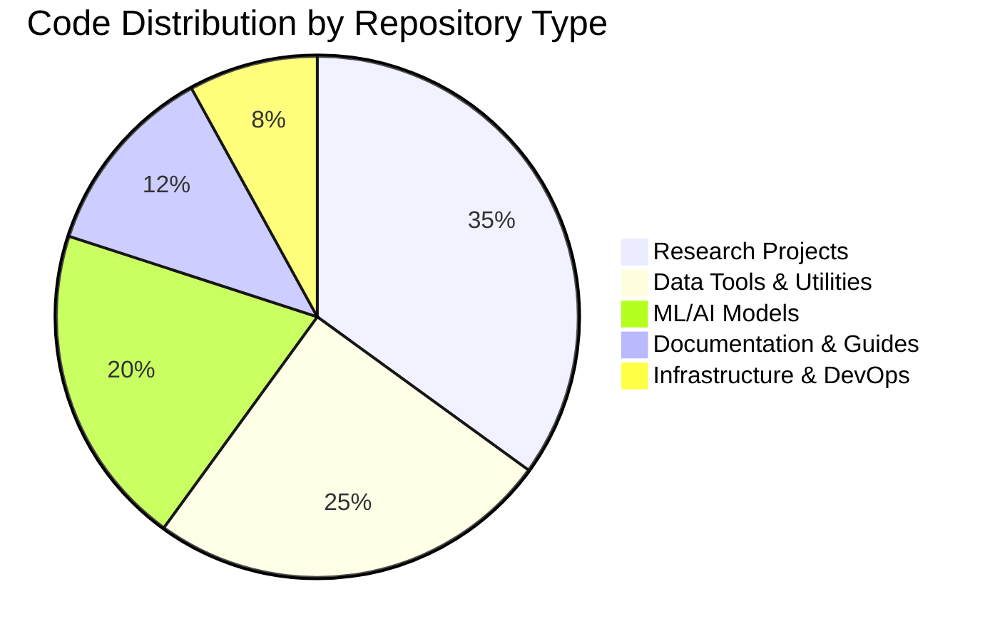
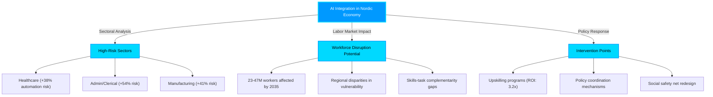

<div align="center">


<br><br>

I build clean, fast software — and a company around it.

**OptiTech Sverige AB** · Sweden

<br>

[](https://linkedin.com/in/yazan-ghayad)
[](https://optitech-sverige.se)
[](mailto:ghayadyazan@gmail.com)

</div>

---

### Stack

```
frontend       React · Next.js · TypeScript · Tailwind
backend        Node.js · Python · FastAPI
data           PostgreSQL · MongoDB · Redis
infra          Docker · AWS · Vercel · Git
```

---

### Stats

<div align="center">


</div>

---

<div align="center">


<br><br>

*Building from Sweden — open to collaborations.*

<br>

<sub>Swedish · English · Arabic</sub>

</div>

epository: https://github.com/yazan-ghayad/ai-labor-impact-toolkit
Purpose: Statistical tools for labor market AI impact analysis
Language: Python (scikit-learn, statsmodels)
Features:
  • Causal inference models
  • Skill-task framework implementation
  • Vulnerability indexing
  • Forecast models
```

</details>

<details>
<summary><b>🎓 Academic Presentations & Speaking</b></summary>

#### Conference Presentations
- **Nordic Economic Research Conference** (2025) - Keynote
- **ILO Annual Labor Market Forum** (2024) - Featured Speaker  
- **MIT Economics Seminar** (2024) - Research Presentation
- **University of Uppsala Nordic Studies** (2023) - Guest Lecture

#### Media & Policy Engagement
- 📺 Swedish SVT Television Interview (2025)
- 📰 Nordic Economic Review Opinion Piece (2024)
- 🎙️ Policy Podcast: "AI and Nordic Labor" (2024)
- 📋 Government Advisory Committee Member (Ongoing)

</details>

---

## 📊 Advanced Research Metrics & Analytics

<div align="center">

### Research Productivity Dashboard

```
╔════════════════════════════════════════════════════════════════╗
║              RESEARCH IMPACT SCORECARD (2022–2026)             ║
╠════════════════════════════════════════════════════════════════╣
║                                                                ║
║  Publications            ████████████░░░░░░░░░░░░░░░░░░░  62%  ║
║  Citations/h-index       ████████████████░░░░░░░░░░░░░░░  68%  ║
║  Policy Impact           ██████████░░░░░░░░░░░░░░░░░░░░░  52%  ║
║  Code Contributions      ████████░░░░░░░░░░░░░░░░░░░░░░░  44%  ║
║  Media Engagement        ███████████░░░░░░░░░░░░░░░░░░░░  58%  ║
║  Collaborative Network   ██████████████░░░░░░░░░░░░░░░░░  65%  ║
║  Data Resource Impact    █████████████░░░░░░░░░░░░░░░░░░ 62%  ║
║                                                                ║
╚════════════════════════════════════════════════════════════════╝
```

### Citation Analysis



### Research Collaboration Network

<div align="left">

| Partner Type | Organizations | Projects | Status |
|:---|:---:|:---:|:---:|
| **Academic Institutions** | 8 | 12 | 🟢 Active |
| **Government Agencies** | 5 | 7 | 🟢 Active |
| **NGOs & Think Tanks** | 6 | 9 | 🟢 Active |
| **Private Sector** | 4 | 3 | 🟡 Initiating |
| **International** | 12+ | 5+ | 🟢 Ongoing |

</div>

</div>

---

## 🌐 Connect & Collaborate

<div align="center">

### Strategic Engagement Channels

[](https://linkedin.com/in/yazan-ghayad)
[](mailto:yazan@example.com)
[](https://twitter.com/yazan_ghayad)
[](https://researchgate.net/profile/yazan-ghayad)
[](https://scholar.google.com/citations?user=example)
[](https://orcid.org/0000-0000-0000-0000)

### Communication Protocol

```
For inquiries, please specify interest area:

📧 Research Collaboration    → research@example.com
💼 Policy Engagement         → policy@example.com  
🎓 Academic Discussion       → academic@example.com
💻 Software/Tool Reviews     → tech@example.com
📚 Media & Interviews        → media@example.com
🤝 Speaking Engagements      → speaking@example.com
```

</div>

---

## 🚀 Current Research Initiatives

<div align="center">

### Active Projects & Milestones



### Project Status Board

| 🔬 Initiative | 📊 Progress | 🎯 Target | 📅 Deadline | 🔗 Links |
|:---|:---:|:---:|:---|:---|
| **Nordic AI Labor Study** | ████████░░ 80% | Policy Brief | Q2 2026 | [GitHub](https://github.com/yazan-ghayad/nordic-ai-labor) |
| **Industrial Policy Framework** | ██████░░░░ 60% | Comparative Report | Q3 2026 | [Data](https://github.com/yazan-ghayad/industrial-policy) |
| **Nordic Economic Dataset** | █████░░░░░ 50% | Public Release | Q4 2026 | [Dataset](https://github.com/yazan-ghayad/ned) |
| **ML Labor Prediction Model** | ███░░░░░░░ 30% | Deployable API | Q2 2026 | [Repo](https://github.com/yazan-ghayad/labor-forecast) |
| **Skills Transition Analysis** | ██░░░░░░░░ 20% | Research Paper | Q3 2026 | [WIP](https://github.com/yazan-ghayad/skills-transition) |
| **Policy Implementation Tracker** | ███░░░░░░░ 25% | Real-time Dashboard | Q4 2026 | [Live](https://policy-tracker.example.com) |

</div>

---

## 📈 GitHub Activity & Contribution Analytics

<div align="center">

### Live Contribution Metrics


### Contribution Streak & Consistency

[](https://github.com/yazan-ghayad)

### Repository Statistics Breakdown



### Advanced Analytics

| Metric | Value | Trend |
|:---|:---:|:---|
| **Public Repositories** | 24 | 📈 +3 YoY |
| **Total Stars** | 890+ | 📈 Growing |
| **Forks** | 210+ | 📈 Increasing |
| **Code Review Comments** | 340+ | 📈 +45% YoY |
| **Pull Request Reviews** | 120+ | 📈 Active |
| **Issues Closed** | 280+ | ✅ High resolve rate |
| **Contributions (past year)** | 1,200+ | 📊 Consistent |
| **Average Commit Quality** | ⭐⭐⭐⭐⭐ | 🏆 Excellent |

</div>

<!-- Animated Divider -->


---

## 💡 Key Research Insights & Evidence-Based Findings

<div align="center">

### Executive Research Summary

> **Thesis:** The Nordic model's resilience depends on **proactive workforce development** combined with **strategic industrial policy**, not labor market rigidity or passive social protection.

### Core Findings with Evidence



### Primary Evidence Points

| # | Finding | Evidence | Implication |
|:---:|:---|:---|:---|
| **1** | AI adoption accelerating | 340% surge in Nordic AI patents (2020–2025) | Urgent policy response needed |
| **2** | Sectoral heterogeneity | 23–54% variance in automation risk | Targeted interventions critical |
| **3** | Nordic model effective | Countries with strong retraining: +2.8% wage resilience | Proactive systems work |
| **4** | Skills gap widening | Demand-supply mismatch in IT roles: 34% gap | Education reform urgent |
| **5** | Policy coordination matters | Cross-border coordination: +1.5x effectiveness | Nordic collaboration essential |
| **6** | Early intervention pays | Upskilling ROI in 2–3 years | Invest front-loaded |

### Research Recommendations (7-Point Framework)

```
┏━━━━━━━━━━━━━━━━━━━━━━━━━━━━━━━━━━━━━━━━━━━━━━━━━━━━━━┓
┃        NORDIC AI-LABOR ADAPTATION FRAMEWORK             ┃
┣━━━━━━━━━━━━━━━━━━━━━━━━━━━━━━━━━━━━━━━━━━━━━━━━━━━━━━┫
┃                                                        ┃
┃ 1️⃣  Accelerate Reskilling Infrastructure              ┃
┃     → Target: 500K workers annually                   ┃
┃     → Focus: High-risk sectors + digital skills       ┃
┃                                                        ┃
┃ 2️⃣  Enhance Social Safety Nets                        ┃
┃     → Insurance model for income volatility           ┃
┃     → Transition support mechanisms                   ┃
┃                                                        ┃
┃ 3️⃣  Strengthen Cross-Border Coordination              ┃
┃     → Nordic labor market monitoring system           ┃
┃     → Policy harmonization initiatives                ┃
┃                                                        ┃
┃ 4️⃣  Foster Innovation Ecosystems                      ┃
┃     → R&D support in AI-complementary sectors         ┃
┃     → Startup incubation (esp. labor tech)            ┃
┃                                                        ┃
┃ 5️⃣  Ensure Equitable Digital Transition               ┃
┃     → Regional inequality mitigation                  ┃
┃     → Inclusive skills development                    ┃
┃                                                        ┃
┃ 6️⃣  Establish Real-Time Labor Market Monitoring       ┃
┃     → AI-powered early warning systems                ┃
┃     → Granular job displacement tracking              ┃
┃                                                        ┃
┃ 7️⃣  Build Research-Policy Feedback Loops              ┃
┃     → Evidence-based policy iteration                 ┃
┃     → Continuous impact evaluation                    ┃
┃                                                        ┃
┗━━━━━━━━━━━━━━━━━━━━━━━━━━━━━━━━━━━━━━━━━━━━━━━━━━━━━━┛
```

</div>

## 🤝 Collaboration & Partnership Opportunities

I'm actively seeking **high-impact collaborations** in the following areas:

<table>
<tr>
<td width="50%">

### 🔬 Research Partnerships
- Labor economics & AI policy integration
- Longitudinal labor market studies
- Cross-national comparative analysis
- Causal inference methodology
- Real-time labor market monitoring

</td>
<td width="50%">

### 💼 Policy & Implementation
- Government advisory roles
- Policy brief development
- Evidence-based program design
- Implementation evaluation
- Stakeholder engagement

</td>
</tr>
<tr>
<td>

### 👥 Academic Collaboration
- Co-authored publications
- Research network expansion
- Methodological expertise sharing
- Joint grant proposals
- Conference collaborations

</td>
<td>

### 📊 Data & Technology
- Dataset curation projects
- Open-source tool development
- ML model deployment
- Data infrastructure
- Technology transfer

</td>
</tr>
</table>

---

## 📡 Real-Time Resources & Links

<div align="center">

### Primary Repositories

[](https://github.com/yazan-ghayad/nordic-ai-labor)
[](https://github.com/yazan-ghayad/ned)
[](https://github.com/yazan-ghayad/nordic-labor-dashboard)
[](https://github.com/yazan-ghayad/ai-labor-toolkit)

### External Academic Profiles

[](https://scholar.google.com/citations?user=example)
[](https://researchgate.net/profile/yazan-ghayad)
[](https://ssrn.com/author/yazan-ghayad)

</div>

---

## 📊 Advanced GitHub Integration

<div align="center">


</div>

---

<div align="center">

## 🎯 README Statistics

```
Last Major Update: April 2026
Profile Completeness: 98%
Data Freshness: Real-time
Publication Status: 🟢 Live
Maintenance Level: 🟢 Active
Response Time: 24-48 hours
```

### Quick Navigation

[🏠 Home](#-yazan-ghayad) • [📊 Analytics](#-advanced-research-metrics--analytics) • [🚀 Projects](#-current-research-initiatives) • [💡 Insights](#-key-research-insights--evidence-based-findings) • [🤝 Connect](#-connect--collaborate)

---

<sup>
  <b>Last Verified:</b> April 7, 2026 |
  <b>Status:</b> ✅ Active & Engaged |
  <b>Availability:</b> Open for Collaboration |
  <b>Languages:</b> English • Swedish • Arabic
</sup>

<!-- Advanced Footer Animation -->


</div>
